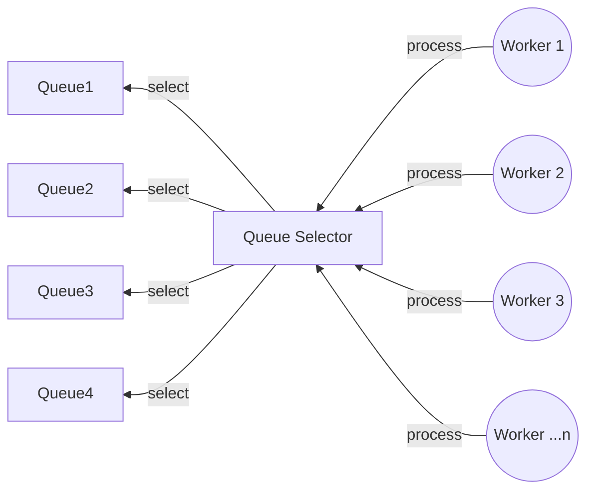
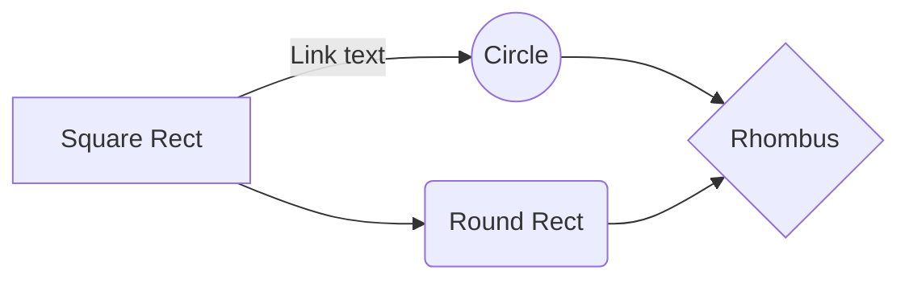
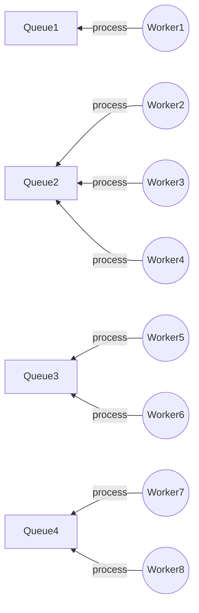

# go-QCoordinator

```mermaid
graph RL
W1((Worker 1)) 
W2((Worker 2)) 
W3((Worker 3)) 
Wn((Worker ...n)) 

Q1[Queue1] 
Q2[Queue2]
Q3[Queue3]
Q4[Queue4]

C[Queue Selector]

C -- select --> Q1
C -- select --> Q2
C -- select --> Q3
C -- select --> Q4

W1 -- process --> C
W2 -- process --> C
W3 -- process --> C
Wn -- process --> C
```

```mermaid
graph LR
A[Square Rect] -- Link text --> B((Circle))
A --> C(Round Rect)
B --> D{Rhombus}
C --> D
```

```mermaid
graph RL
W1((Worker1)) 
W2((Worker2)) 
W3((Worker3)) 
W4((Worker4)) 
W5((Worker5)) 
W6((Worker6)) 
W7((Worker7)) 
W8((Worker8)) 

Q1[Queue1] 
Q2[Queue2]
Q3[Queue3]
Q4[Queue4]

W1 -- process --> Q1

W2 -- process --> Q2
W3 -- process --> Q2
W4 -- process --> Q2

W5 -- process --> Q3
W6 -- process --> Q3

W7 -- process --> Q4
W8 -- process --> Q4

```